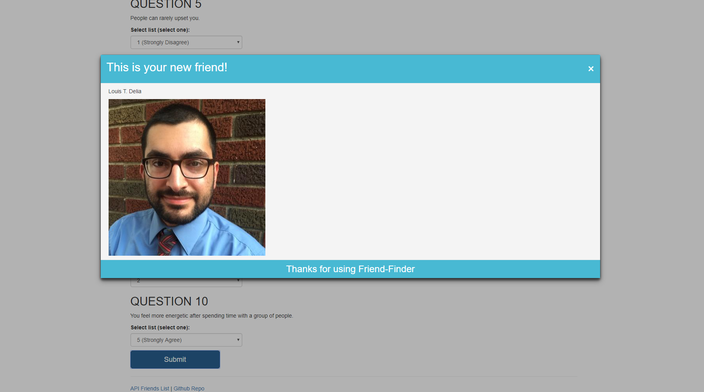

# friend-finder

## Synopsis

* [Video Walkthrough](https://drive.google.com/file/d/1Hd5DhCQRMk4QLomWe6hUPpcrGxyMWQRe/view)

Friend Finder is an app that will match you with a person who shares similar interests or views with you.  You answer a series of questions, with a score of 1 (strongly disagree) to 5 (strongly agree).  The scores are then compared with all available friends and your closest match is returned.

This is a heroku app, used in a browser.

## Motivation

This was created as a project for KU Coding Bootcamp

## Using the App

Click "Take the Survey"

Input your information, answer the questions, and when you click submit, your friend will appear.

## Tech Reference

* [Heroku](https://www.heroku.com)

* [Express](https://expressjs.com)

* [Bootstrap](https://getbootstrap.com)

* [Font Awesome](https://fontawesome.com)